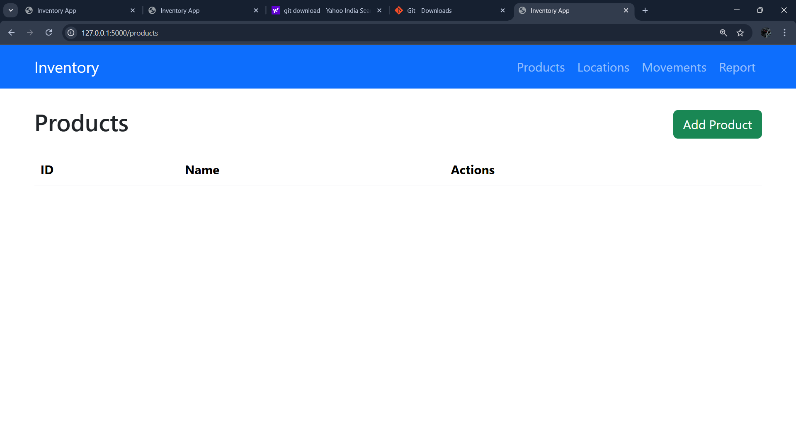
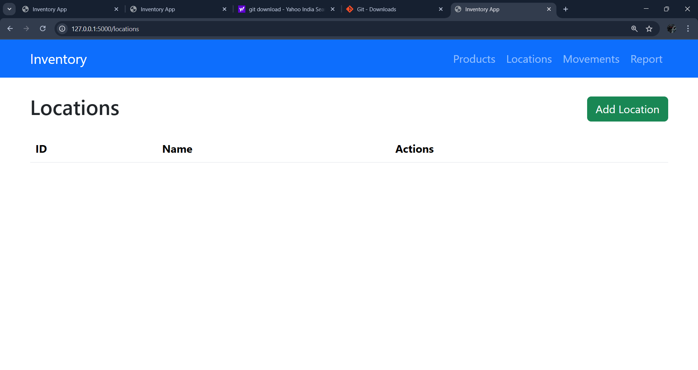
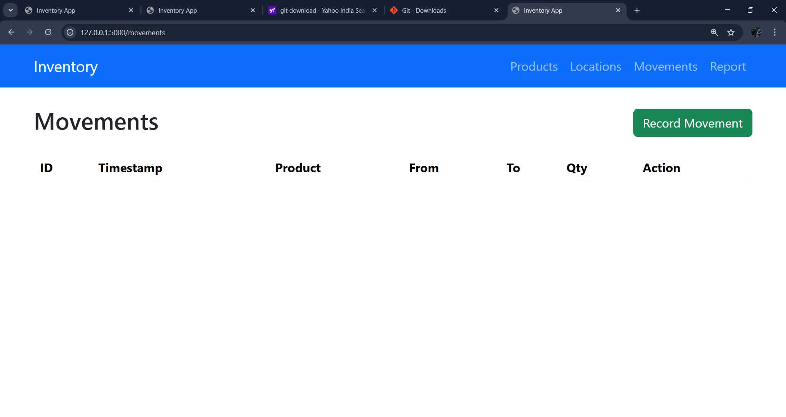
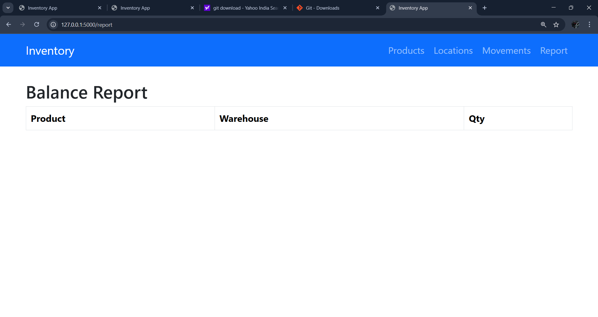

# Inventory Management Application

This is a Flask-based inventory management system with the following features:

- Add, delete, and view products
- Add, delete, and view warehouse locations
- Track product movements between locations
- Generate stock reports and highlight low-stock products

## Screenshots

### Product Page

### Locations Page

### Product Movements

### Stock Report

Installation
Clone the repository:
git clone  https://github.com/Gokulvg2005/inventory_app
